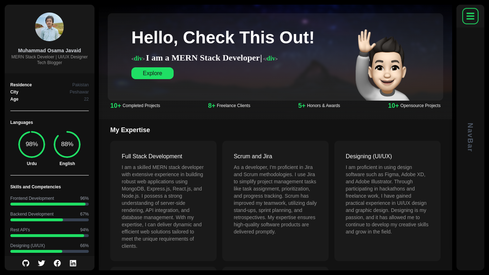

  
  
  
  

   
   
  
  

  <h2 align="center">Muhammad Osama Javaid - Personal portfolio</h2>

This website is fully responsive personal portfolio,  Responsive for all devices, built using Nextjs, TailwindCSS only.

<a href="https://osamajavaid.vercel.app/"><strong>➥ Live Demo</strong></a>

 

### Demo Screeshots

### Prerequisites

Before you begin, ensure you have met the following requirements:

- [Git](https://git-scm.com/downloads "Download Git") must be installed on your operating system.

### Contact

If you want to contact with me you can reach me at [Linkedin](https://www.linkedin.com/in/jntnyl).

### License

This project is **free to use** and does not contains any license.
